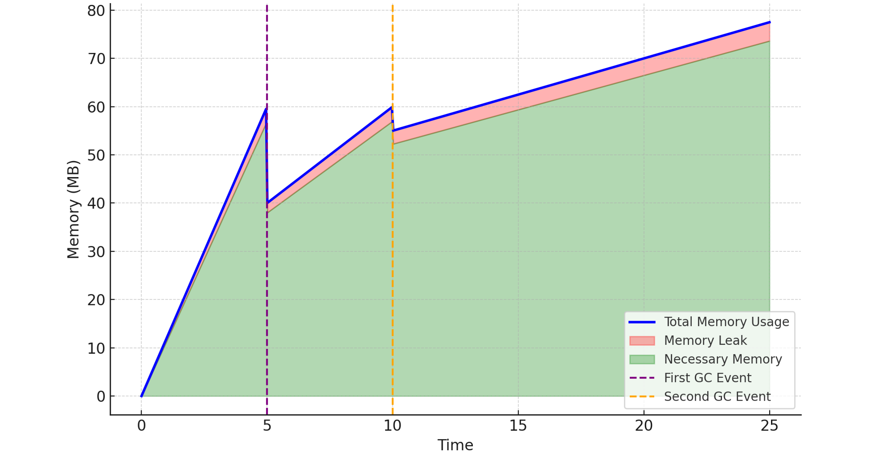

# Memory Leak Detection and Prevention in Node.js

## Introduction
This repository provides tools and tips for debugging and preventing memory leaks in Node.js applications. While the focus is on Node.js, many concepts are also applicable to browser-based JavaScript and other languages, especially regarding heap snapshot comparison techniques.

> Note: Some concepts are simplified for clarity. For deeper understanding, please refer to the references section at the end of this document.

## What is a Memory Leak?

A memory leak can be described as:
> "It's like not checking out of a hotel room when you leave. The room remains occupied but unused, preventing other guests from using it until it's freed."

In low-level languages like C, memory leaks occur when allocated memory isn't explicitly released when no longer needed. However, with the invention of garbage collection by John McCarthy, this manual memory management is no longer necessary in many modern languages.

### Garbage Collection Basics

The Garbage Collector (GC) is a critical component of modern runtime environments that manages memory automatically. Its primary responsibilities include:

1. **Memory Tracking**: Monitoring objects and their references in the application
2. **Memory Reclamation**: Identifying and collecting unused memory for reuse
3. **Memory Release**: Returning unused memory to the operating system when appropriate

#### How GC Determines What to Collect

The GC uses reachability to determine if an object is still needed:
- An object is considered "reachable" if it can be accessed from root objects through a chain of references
- Root objects typically include global objects, the call stack, and active function closures
- Any object that becomes unreachable (has no references pointing to it) is eligible for collection

For example:
```javascript
let obj = { data: 'some data' }; // obj is reachable
obj = null; // original object becomes unreachable and eligible for GC
```

#### Developer's Role

While the GC handles memory management automatically, developers still play a crucial role in preventing memory leaks by:
- Properly releasing references when objects are no longer needed
- Being mindful of object lifecycles, especially with event listeners and timers
- Avoiding unnecessary references to large objects
- Being careful with global variables and caches

A memory leak occurs when the application maintains references to objects that are no longer needed, preventing the GC from collecting them. This leads to gradually increasing memory consumption over time.

---

#### 3. **Understanding Memory Leaks in Node.js**
In order to understand, better memory, leaks, and how to handle them first of all, we need to understand how the garbage collector V8 works
 v8 gc Is responsible Deduction of unused Memory And reuse the memory occupied by dead objects

 The algorithm V8 GC (Orinoco) uses is (The tracing algorithm)[https://en.wikipedia.org/wiki/Tracing_garbage_collection]
 Which basically means In order to know which objects are not in use aka Dead objects and need to be Reclaimed
 We trace a set of root objects Every object that is reachable From those root objects Is an object that can be used by the program and therefore is a alive

 Any other object is a dead object that no one needs anymore

 In a V8, those objects are the stack end global object 
 *** First tip Any object that is attached, directly or indirectly (by his parent or grandparent object) to the global is going to be alive for the entire time of the application, and there for never be released 
Don't attach anything (that you don't actually need) to the global 

Functions in the stack can Hold reference to objects by closure 
If you don't know what closure is, that's the time to go read about that


   
   - **How the Garbage Collector (GC) Works in Node.js**  

   In garbage collection there is an important term: “The Generational Hypothesis”. This basically states that most objects die young. In other words, most objects are allocated and then almost immediately become unreachable, from the perspective of the GC. This holds not only for V8 or JavaScript, but for most dynamic languages.

   Leveraging this fact are two GCs in V8 
     - Minor GC (Scavenger)
     - Major GC (Mark-Compact)Leveraging
    the Scavenger is Quicker And handles only new objects 


    the Major GC Is slower Consume more resources And responsible for the entire heep

the Minor GC runs more often then the majro gc
    
v8 will promote objects, not garbage collected after two Scavenge operations to the old space.
```
        young generation         |   old generation
                                 |
  nursery     |  intermediate    |
              |                  |
 +--------+   |     +--------+   |     +--------+
 | object |---GC--->| object |---GC--->| object |
 +--------+   |     +--------+   |     +--------+
              |                  |
```


---

#### 4. **Common Causes of Memory Leaks in Node.js**
   - **Uncleared Listeners and Event Emitters**  
     - Every listenr there in JavaScript is a potential memory leak As long as you don't clear the listener All the objects hold reference by closure And all the objects they are referencing to Will not be collected 

Best practice

Every time you write a listener Also write the code that clear is this listener when it's no longer needed 

Currently the listen, Eric, and all the reference to Some small object
But in the future, someone can attach to this object, bigger object, and you're fucked
   
   - **Global Variables and Caching**  
     - Risks of caching too much data or keeping references to large objects in global scope.
   
   - **Closures and Function Scopes**  
     - Issues arising from closures and retaining variables longer than needed.
   

---

#### 5. **Using `WeakMap` and FinalizationRegistry to Detect Garbage Collection (GC) Activity**
   - **Introduction to `WeakMap`**  
     - Explanation of how `WeakMap` works in JavaScript.
   
   - **Tracking Object Collection with `WeakMap`**  
     - Using `WeakMap` to see if objects are garbage-collected, providing insight into potential memory leaks.
  - FinalizationRegistry
   
---

#### 6. **Forcing Garbage Collection in Node.js (Manual GC Trigger)**
   - **How to Trigger Garbage Collection in Node.js**  
     - Using the `--expose-gc` flag and calling `global.gc()` for debugging purposes.
   
   - **When and Why to Use Manual GC**  
     - Guidelines for using manual GC for memory testing only, not in production.

---

#### 7. **Using the Snip3 Hunt Method**
By following this approach, you can significantly improve the clarity of your heap dump comparisons and identify memory leaks more effectively. This methodology provides a structured way to isolate leaks while minimizing noise, making debugging in real-world applications far more manageable.


**Heap Dump Analysis: Challenges and an Improved Approach**

Heap dump analysis can show what is leaking, but it dosnot identify where in the code the issue originates. The biggest challenge in using heap dump comparisons to detect memory leaks is separating useful information from noise.

Anyone who has tried to debug a memory leak in a real-world application using heap dumps knows how difficult it can be to identify what is leaking—even before considering where the leak originates. many advisors suggest the following approach: 

1. Create a snapshot when the application starts.  
2. Run the application for an extended period.  
3. Take another snapshot.  
4. Compare the snapshots to identify the largest leaking objects.

While this method may work for simple examples, it fails in complex, real-world scenarios. 

the reason is that in the exmples the memory snapshots compersion looks like this:  


-- show image of simple meory snapshot comprions  


but in the real world it looks like this  


-- show image of very big heap snapshot comprision


and you will look like this  


-- show image of very Disappointed developer

In practice, after running an application for a few days to "trigger" the memory leak, you often end up with so much noise that it’s nearly impossible to find the root cause. This is the point where some developers resort to quick fixes, such as restarting the server after every 10 calls—a workaround that can even be automated using tools like Kubernetes.

the reason for that is how appliciton memory lif sycle looks like:

Let's look how memories are alocated For the lifetime of our Application

In the beginning, the server allocates a significant amount of memory for initializing objects such as database connections. After the garbage collector (GC) runs, the memory usage is reduced, leaving only the necessary objects.

When the first endpoint is called, additional memory is allocated for initializing various objects. Some of these objects are temporary and will be collected by the GC, while others are retained as they are necessary for the operation of the endpoint.

Additionally, a small memory leak exists. By comparing heap dumps taken immediately after the first GC and the second GC, you can observe the memory leak alongside a significant amount of necessary memory allocations.

This creates a lot of noise in the comparison as we already discussed and it's very hard to Investigate what is the object leakingLet's look how memories are alocated For the lifetime of our Application

In the beginning, the server allocates a significant amount of memory for initializing objects such as database connections. After the garbage collector (GC) runs, the memory usage is reduced, leaving only the necessary objects.

When the first endpoint is called, additional memory is allocated for initializing various objects. Some of these objects are temporary and will be collected by the GC, while others are retained as they are necessary for the operation of the endpoint.

Additionally, a small memory leak exists. By comparing heap dumps taken immediately after the first GC and the second GC, you can observe the memory leak alongside a significant amount of necessary memory allocations.

This creates a lot of noise in the comparison as we already discussed and it's very hard to Investigate what is the object leaking



However, there is a better solution: analyzing memory allocations throughout the application's lifecycle. Here's how to do it step by step:

---

### **Improved Memory Leak Detection Approach**

1. **Initial Setup and Noise Reduction**
   - Begin by disabling modules unrelated to the area you're investigating to reduce noise.
   - Start the application and trigger all necessary initialization routines. This ensures all essential objects (e.g., ORM objects, database connections, WebSocket handlers, background workers, etc.) are allocated.

2. **First Heap Dump**
   - Run the garbage collector (GC) to clean up unnecessary objects.
   - Take the first heap dump, which will represent the memory state immediately after initialization.

3. **Targeted Leak Triggering**
   - Focus on a specific area of the system that you suspect is leaking. Trigger this area multiple times to make the leak more noticeable.
   - Run the GC again to clean up temporary allocations, and take the second heap dump.

4. **Third Heap Dump for Noise Reduction**
   - Wait for a minute or more to allow temporary allocations to stabilize.
   - Trigger the GC once more to collect all temporary memory allocated between snapshots 1 and 2.
   - Take a third heap dump.

5. **Comparison for Leak Identification**
   - Compare memory allocations between snapshot 1 and snapshot 2. Identify memory that was allocated but not removed by the GC in snapshot 3.
   - This method filters out 99% of the noise caused by temporary allocations, leaving only the true memory leak.


---

#### 8. **Case Study: Jest’s Memory Leak Detection Using `WeakMap`**
   - **How Jest Uses `FinalizationRegistry` for Leak Detection**  
     - Explanation of how Jest leverages `FinalizationRegistry` to detect memory leaks in tests.
   
   - **Applying the secret Jest Approach in Your Code or Tests**  
     - Practical steps to integrate a similar `FinalizationRegistry` strategy for tracking leaks in your own testing setup.

---

#### 9. **Tools and Techniques for Memory Leak Detection**
   - **Node.js Native Tools**  
     - Brief on tools like Chrome DevTools, `node --inspect`, and `node-heapdump`.
   
   - **Additional Utilities**  
     - Mention of tools like `clinic.js`, `memwatch-next`, or any other preferred memory profiling utilities.

---

#### 10. **Best Practices for Preventing Memory Leaks in Node.js**
   - **Guidelines for Managing Event Listeners and Closures**  
   - **Efficient Use of Global Variables and Caches**  
   - **Regularly Profiling and Monitoring Memory Usage**
   - **allways run your jest with --detectLeaks**
   Always use the function names
   Trying not to use at all anonymous function Because if any time in the future you will need to use cpu Profiler or memory Profiler, the only thing you will see is anonymous -> anonymous -> fuckmylife -> anonymous
   If you Will use classes. Instead of anonymous objects. It will be much easier to track memory lakes in the future. 

---

#### 11. **Conclusion**
   - Recap of key points.
   - Encouragement to incorporate memory management strategies into routine development and testing.
#### Refs
https://jestjs.io/blog/2017/12/18/jest-22#experimental-leak-detection
https://github.com/jestjs/jest/pull/12973
https://developer.mozilla.org/en-US/docs/Web/JavaScript/Reference/Global_Objects/FinalizationRegistry
https://v8.dev/blog/trash-talk
https://v8.dev/blog/tracing-js-dom

https://nodejs.org/en/learn/diagnostics/memory/using-gc-traces

### relevant
https://dev.to/codux/experiments-with-the-javascript-garbage-collector-2ae3

### memory leak in nodejs
https://github.com/nodejs/node/issues/53335
https://github.com/nodejs/node/blob/main/test/parallel/test-primitive-timer-leak.js#L15
https://github.com/nodejs/node/blob/main/test/common/gc.js

### Research
check if global.gc call minor or Major gc