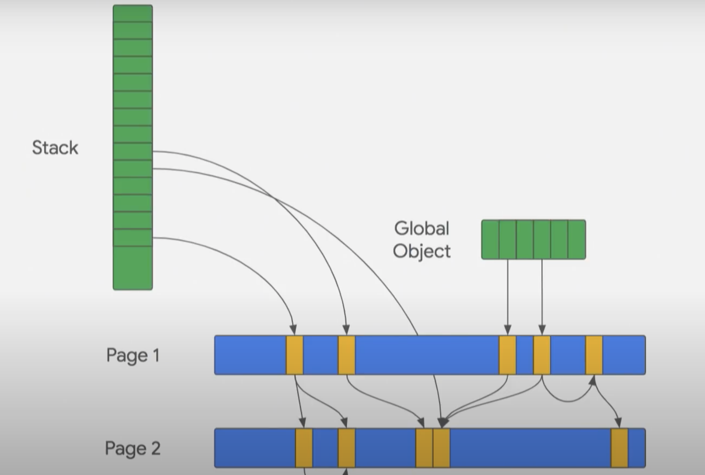

# Memory Leak Detection and Prevention in Node.js

## Introduction
This repository provides tools and tips for debugging and preventing memory leaks in Node.js applications. While the focus is on Node.js, many concepts are also applicable to browser-based JavaScript and other languages, especially regarding heap snapshot comparison techniques.

> Note: Some concepts are simplified for clarity. For deeper understanding, please refer to the references section at the end of this document.

## What is a Memory Leak?

A memory leak can be described as:
> "It's like not checking out of a hotel room when you leave. The room remains occupied but unused, preventing other guests from using it until it's freed."

In low-level languages like C, memory leaks occur when allocated memory isn't explicitly released when no longer needed. However, with the invention of garbage collection by John McCarthy, this manual memory management is no longer necessary in many modern languages.

### Garbage Collection Basics

The Garbage Collector (GC) is a critical component of modern runtime environments that manages memory automatically. Its primary responsibilities include:

1. **Memory Tracking**: Monitoring objects and their references in the application
2. **Memory Reclamation**: Identifying and collecting unused memory for reuse
3. **Memory Release**: Returning unused memory to the operating system when appropriate

#### How GC Determines What to Collect

The GC uses reachability to determine if an object is still needed:
- An object is considered "reachable" if it can be accessed from root objects through a chain of references
- Root objects typically include global objects, the call stack, and active function closures
- Any object that becomes unreachable (has no references pointing to it) is eligible for collection

For example:
```javascript
let obj = { data: 'some data' }; // obj is reachable
obj = null; // original object becomes unreachable and eligible for GC
```

#### Developer's Role

While the GC handles memory management automatically, developers still play a crucial role in preventing memory leaks by:
- Properly releasing references when objects are no longer needed
- Being mindful of object lifecycles, especially with event listeners and timers
- Avoiding unnecessary references to large objects
- Being careful with global variables and caches

A memory leak occurs when the application maintains references to objects that are no longer needed, preventing the GC from collecting them. This leads to gradually increasing memory consumption over time.

## Understanding Memory Leaks in Node.js

Node.js uses V8 as its JavaScript engine, which includes a sophisticated garbage collection system. Understanding how V8's garbage collector works is crucial for preventing and debugging memory leaks.

### V8 Garbage Collector Overview

V8's garbage collector (Orinoco) uses a tracing algorithm to manage memory. Here's how it works:

1. **Root Objects**: The GC starts from a set of root objects, which include:
   - Global objects (`global` in Node.js, `window` in browsers)
   - Local variables in the current call stack
   - Active closures and their variables

2. **Tracing Process**: 
   - The GC traces through all references starting from these root objects
   - Any object reachable through this tracing is considered "alive"
   - Unreachable objects are marked as candidates for collection

> **Important**: Any object attached to the global scope (directly or indirectly) will remain alive for the entire application lifetime. Be cautious about adding properties to global objects.




### Generational Collection

V8 implements a generational garbage collection strategy based on the "Generational Hypothesis" - the observation that most objects die young. This means:

1. Most objects are created, used briefly, and then become garbage quickly
   ```javascript
   function processRequest(req) {
     const tempData = { ... }  // Created
     doSomething(tempData)     // Used briefly
     return result             // Now eligible for GC
   }
   ```

2. Objects that survive longer tend to live much longer
   ```javascript
   // Long-lived objects example
   const server = new Server()  // Lives for entire program
   const cache = new Cache()    // Lives for entire program
   ```

This behavior pattern led V8 to implement two distinct garbage collection mechanisms, each optimized for different object lifetimes:

1. **Minor GC (Scavenger)**
   - Focuses on new, short-lived objects
   - Runs frequently and quickly
   - Perfect for those temporary objects in your request handlers

2. **Major GC (Mark-Compact)**
   - Handles longer-lived objects
   - Runs less frequently but more thoroughly
   - Deals with those persistent server and cache objects

Objects move through memory spaces as they age:

```
        young generation         |   old generation
                                 |
  nursery     |  intermediate    |
              |                  |
 +--------+   |     +--------+   |     +--------+
 | object |---GC--->| object |---GC--->| object |
 +--------+   |     +--------+   |     +--------+
  New objects |      Survived    |     Long-lived
              |    one GC cycle  |       objects  
```
Objects that survive two minor GC cycles are promoted to the old generation, where they're managed by the major GC.

---

## Common Causes of Memory Leaks in Node.js

1. **Event Listeners**
   - Every listener is a potential memory leak if not properly cleared
   - Listeners retain all referenced objects through closures
   - Even if you're only holding small objects now, future code changes might attach larger objects to them
   ```javascript
   // Always pair listener creation with cleanup
   element.on('data', handler);
   element.removeListener('data', handler); // Clean up when done
   ```

2. **Global Variables**
   - Objects in global scope persist for the entire application lifetime
   - What starts as a small object might grow significantly as other developers add data
   - Avoid storing large objects or using unbounded caches globally

3. **Closures**
   - Variables in closures remain in memory for the function's entire lifetime
   - Be careful with large objects in long-lived closures
   - Small initial objects can grow as code evolves

> **Best Practice**: Always plan for cleanup when using listeners, global variables, or closures. Remember that today's small memory footprint might grow significantly as the codebase evolves. 

---

## Tips and Tricks for Debugging Memory Leaks

### 1. Using WeakMap for Reference Tracking

WeakMap is a powerful tool for tracking object references without preventing garbage collection:

```javascript
const tracker = new WeakMap();

function trackObject(obj, metadata) {
  tracker.set(obj, {
    createdAt: Date.now(),
    ...metadata
  });
}

// Usage
const myObject = { /* ... */ };
trackObject(myObject, { id: 'important-object' });
// If myObject becomes unreachable, its entry in tracker
// will automatically be removed
```

#### Debugging Memory Leaks with WeakMap

WeakMap provides a production-safe way to debug potential memory leaks. Since WeakMap doesn't prevent garbage collection, you can use it to monitor objects without affecting the application's memory behavior:

```javascript
// Create a global tracker (only for debugging)
global.leakTracker = new WeakMap();

function debugTrackObject(obj, metadata) {
  const trackedData = {
    createdAt: Date.now(),
    stack: new Error().stack, // Capture creation stack trace
    ...metadata
  };
  global.leakTracker.set(obj, trackedData);
}

// Monitor Express request objects for memory leaks
app.use((req, res, next) => {
  debugTrackObject(req, {
    id: `request-${Date.now()}`,
    type: 'ExpressRequest',
    url: req.url,
    method: req.method
  });
  next();
});

// Check for leaks periodically
setInterval(() => {
  // Force GC if available (development only)
  if (global.gc) global.gc();
  
  // Try to access some tracked objects
  const knownObjects = [/* ... list of objects you want to check ... */];
  
  knownObjects.forEach(obj => {
    const data = global.leakTracker.get(obj);
    if (data) {
      console.log(`Object ${data.id} still exists after ${
        (Date.now() - data.createdAt) / 1000
      } seconds`);
      console.log('Created at:', data.stack);
    }
  });
}, 60000);
```

### 2. FinalizationRegistry for GC Notifications

FinalizationRegistry lets you know when objects are garbage collected:

```javascript
const registry = new FinalizationRegistry((heldValue) => {
  console.log(`Object with ID ${heldValue} was garbage collected`);
});

function createTrackedObject() {
  const obj = { /* ... */ };
  registry.register(obj, "object-123");
  return obj;
}
```

### 3. Manual GC Triggering for Testing

For debugging purposes, you can manually trigger garbage collection:

```bash
# Start Node.js with GC exposure
node --expose-gc your-script.js
```

```javascript
// In your code
function checkForLeaks() {
  const initialMemory = process.memoryUsage().heapUsed;
  
  // Force GC
  global.gc();
  
  const afterGC = process.memoryUsage().heapUsed;
  console.log(`Memory change: ${(afterGC - initialMemory) / 1024 / 1024} MB`);
}

```

### Important Notes:

1. **Manual GC Usage**:
   - Only use manual GC triggering in development/testing
   - Never use in production as it can impact performance
   - Useful for creating reproducible test cases

2. **WeakMap and FinalizationRegistry**:
   - Use WeakMap when you need to associate data with objects without preventing GC
   - FinalizationRegistry is great for debugging but don't rely on it for critical functionality
   - Callbacks in FinalizationRegistry may be delayed or batched


## Heap Dump Comparison Using the Snip3 Hunt Method

Heap dump analysis can show what objects are leaking memory, but it doesn't identify where in the code the issue originates. The biggest challenge in using heap dump comparisons to detect memory leaks is separating useful information from noise.

### The Simple Method

Many guides suggest this basic approach for memory leak detection:

1. Create a snapshot when the application starts
2. Run the application for an extended period
3. Take another snapshot
4. Compare the snapshots to identify the largest leaking objects

### Why the Simple Method Fails

While this method works for simple examples, it often fails in complex, real-world scenarios. Let's understand why:

#### Expectation vs Reality

In simple examples, memory snapshot comparisons look clean and straightforward:
```
Simple Example:
leaked object A: +1000 bytes
Object B: +500 bytes
```

However, in real-world applications, comparisons are overwhelmingly complex:
```
Real World:
... (thousands of entries)
Object A: +1.2MB
Object B: +800KB
Object C -> D -> leaked object E: +2.3MB
... (thousands more entries)
```

This complexity often leaves developers frustrated and reaching for quick fixes, such as automated server restarts through Kubernetes.

#### Understanding Application Memory Lifecycle

To understand why this happens, let's examine how memory is allocated throughout an application's lifecycle:

1. **Initial Allocation**
   - Server allocates memory for core components (database connections, etc.)
   - First GC run reduces memory to essential objects only

2. **Endpoint Operations**
   - New memory allocated for request handling
   - Some objects are temporary (GC collectable)
   - Others are retained for endpoint functionality
   - Small memory leaks may occur

3. **The Comparison Problem**
   - When comparing heap dumps after GC runs, you see:
     - Necessary retained memory
     - Actual memory leaks
     - Various temporary allocations
   - This mixture creates significant noise, making leak detection difficult


Fortunately, there's a better approach to handle this complexity, which we'll explore in the next section...

### **Snip3 Hunt Method the Improved Memory Leak Detection Approach**

By following this approach, you can significantly improve the clarity of your heap dump comparisons and identify memory leaks more effectively. This methodology provides a structured way to isolate leaks while minimizing noise, making debugging in real-world applications far more manageable.

1. **Initial Setup and Noise Reduction**
   - Begin by disabling modules unrelated to the area you're investigating to reduce noise.
   - Start the application and trigger all necessary initialization routines. This ensures all essential objects (e.g., ORM objects, database connections, WebSocket handlers, background workers, etc.) are allocated.

2. **First Heap Dump**
   - Run the garbage collector (GC) to clean up unnecessary objects.
   - Take the first heap dump, which will represent the memory state immediately after initialization.

3. **Targeted Leak Triggering**
   - Focus on a specific area of the system that you suspect is leaking. Trigger this area multiple times to make the leak more noticeable.
   - Run the GC again to clean up temporary allocations, and take the second heap dump.

4. **Third Heap Dump for Noise Reduction**
   - Wait for a minute or more to allow temporary allocations to stabilize.
   - Trigger the GC once more to collect all temporary memory allocated between snapshots 1 and 2.
   - Take a third heap dump.

5. **Comparison for Leak Identification**
   - Compare memory allocations between snapshot 1 and snapshot 2. Identify memory that was allocated but not removed by the GC in snapshot 3.
   - This method filters out 99% of the noise caused by temporary allocations, leaving only the true memory leak.


#### Refs
https://jestjs.io/blog/2017/12/18/jest-22#experimental-leak-detection
https://github.com/jestjs/jest/pull/12973
https://developer.mozilla.org/en-US/docs/Web/JavaScript/Reference/Global_Objects/FinalizationRegistry
https://v8.dev/blog/trash-talk
https://v8.dev/blog/tracing-js-dom

https://nodejs.org/en/learn/diagnostics/memory/using-gc-traces

### relevant
https://dev.to/codux/experiments-with-the-javascript-garbage-collector-2ae3

### memory leak in nodejs
https://github.com/nodejs/node/issues/53335
https://github.com/nodejs/node/blob/main/test/parallel/test-primitive-timer-leak.js#L15
https://github.com/nodejs/node/blob/main/test/common/gc.js

### Research
check if global.gc call minor or Major gc